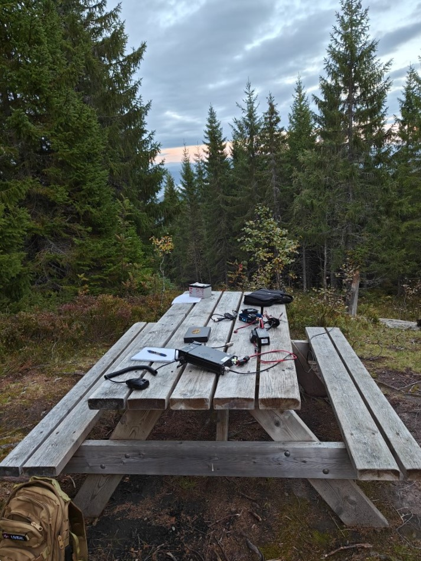
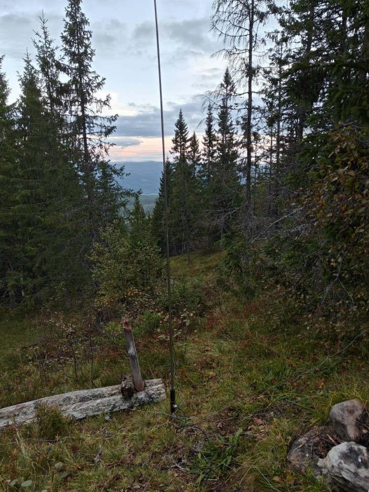
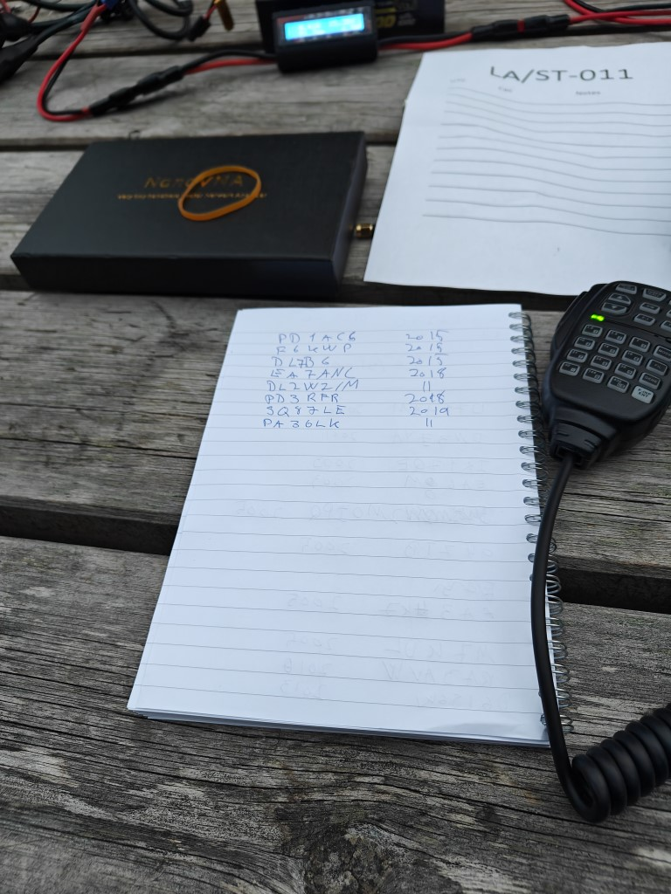
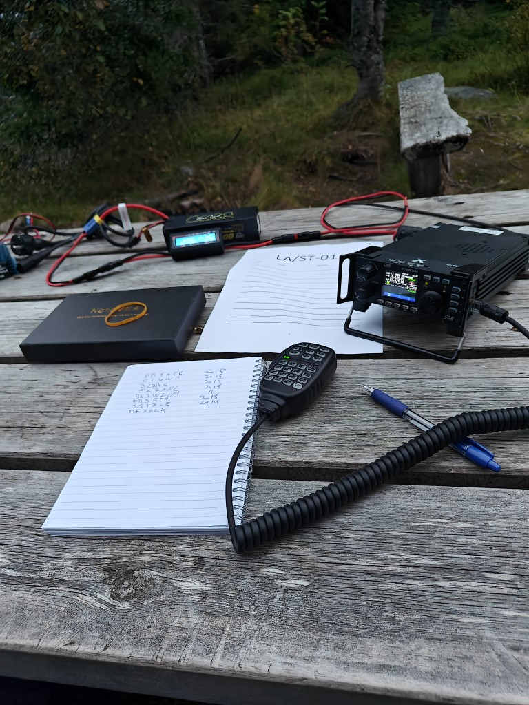

For my second SOTA activation I decided to try something new. [Liaåsen, LA/ST-011](https://sotl.as/summits/LA/ST-011) is a small hill just outside Trondheim, Norway with a transmitter mast on top. It's a popular location for hiking and quite popular with SOTA hams. I have been there before, but for other reasons than SOTA. My previous activation I used a [PAC-12 7MHz-50MHz antenna](https://s.click.aliexpress.com/e/_DBHrEoj) from Aliexpress and it worked okay, but it was quite narrow banded and I wanted to remedy that. In my box of radio stuff I had a [5.6m whip antenna](https://www.aliexpress.com/item/1005006677951151.html) that would be the perfect length for 20m. Since its segmented it would also allow me to easily do 17m and 10m. Very fortunately there was a bench we could install ourselves and the equipment on.

After adjusting the lenght using my trust NanoVNA the Xiegu G90 from [Radioddity](https://radioddity.refr.cc/default/u/mikaelm?s=esp) I did not even need tune antenna as the SWR was 1.0 across allof the 20m band! I was very pleased with that. That means I probably dont need to bring all of the PAC-12 kit with me unless I want to so 40m. I also started on a 3D-printed base for the antenna using some hardware from the local hardware store - but that will have to wait for another day.

Then we let the action begin, and on the very first CQ call I got a QSO even before I spotted myself on SOTA watch! [DJ1HAM](https://www.qrz.com/db/DJ1HAM) was my contact and we had a short but nice QSO on 20m SSB. Then the contacts started pouring in and since I am very new at this I got som help from Stian [LB5SH](https://lb5sh.no/) to deciper and note down the call signs. This is definately something I need to work on improving, but it will come with time and practice. After 30 minutes I had 26 QSOs in my log and Stian asked if he could have little go at the radio. Obiviously it would only be a couple of minutes since it started getting dark and we had to return from the summit soon. Obviously.

However, he also started to get pileups and the he got hooked! It was really fun and a great learning experience to watch a much more experienced operator work the radio. After 15 minutes we took a short break and hooked a linear amplifier into the signal path to see how that would work. We did not have a power meter so we are not sure how many watts it was transmitting on, but somewhere between 50 and 70 is my guess. This little amplifier helped us reach even further and combined with the greyline even more pileup happened and Stian was working stations like a pro! Half an hour later he had a log of 36(!) QSOs! It was then time to call it as it was getting quite dark, and we had to leave quite a few still calling for us. Sorry about that, but safety first!

Happily we returned without too many challenges and we are ready for the next SOTA adventure!

